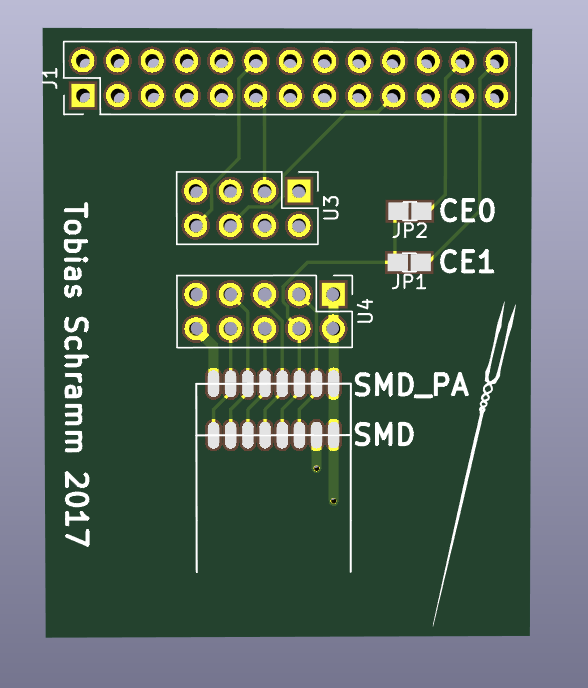
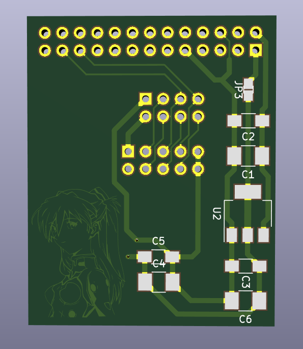

Raspberry Pi NRF Shield
=======================

Small and simple Shield for NRF24 wireless modules. Supports several SMD and non-SMD NRF24 footprints.

Backside provides footprints for installation of additional smoothing capacitors (please install at least one 100 nF capacitor, a lot of NRF modules become really unstable without one) and a 3.3 V regulator for use with high current draw NRF modules with builtin power amplifiers.

Goes well together with https://github.com/TobleMiner/kernelstuff/tree/master/modules/nrf24l01

PCB top

PCB bottom

